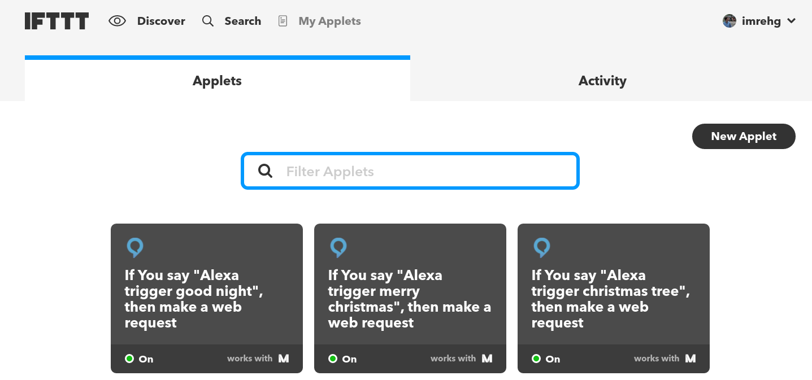

# Alexa + SenseHAT + Christmas Tree Combo

Control an 8x8 pixel LED matrix display Christmas tree with your voice through
Amazon Alexa / Echo Dot. It is powered by:

Check out the [demo on Youtube](https://youtu.be/TTfYyCeXLJw) (click the image):

The photos/videos barely do any justice to the view, so here's an approximate
outline of how the display should look like:

And the flickering candles view:

### Components

This project is powered by the following services:

* [Amazon Echo](https://www.amazon.co.uk/echo‎) (US or UK at the moment)
* [If This Than That (IFTTT)](https://ifttt.com) and particular the
  [Alexa service](https://ifttt.com/amazon_alexa) for super easy voice commands,
  and [Maker service](https://ifttt.com/maker) for super easy HTTP triggers
* [resin.io](https://resin.io) for super easy code deployment to your IoT device,
  and for publicly accessible device URLs

#### Hardware Requirements

* Amazon Echo / Echo Dot / other device set up like an Echo
* Raspberry Pi connected to the internet
* [SenseHAT](https://www.raspberrypi.org/products/sense-hat/) for 8x8 LED matrix

### Setting Up

If you haven't yet, register to [resin.io](https://resin.io), log in, and set up
a new application for this project. Download the SD card image provided in the
resin.io dashboard, flash it on an SD card (more info on that in this
[Getting Started Guide](https://docs.resin.io/raspberrypi3/nodejs/getting-started/)!)

Assemble your Raspberry Pi 3 + SenseHAT, and boot it from the SD card. If
everything goes well, it shows up in your dashboard!

Clone this project to your computer, and push the code to resin.io (see the
above mentioned Getting Started Guide for more details). Wait until the device
downloads your application update.

In the resin.io dashboard enable the Public Device URL for this device (note
the URL down!), and visit the link. Try out the different endpoints mentioned
below, see whether the display changes. If it does, you are almost there!

Go to [IFTTT](https://ifttt.com), and create three applets for the three triggers,
using your verbal phrases and the URL with the different endpoints noted below.

After this, you should be ready to go, just talk to Alexa, and it will talk to
your brand new virtual Christmas tree!

### Control Endpoints

* `/tree`: tree view
* `/christmas`: candle view
* `/off`: clear display

### Settings

These settings you can modify by setting up an environment variable (in the
resin.io dashboard) with a suitable value:

* `ROTATE`: rotating the LED matrix display (so it can be placed down
  differently). Acceptable values `0` (default), `90`, `180`, `270`
  (these mean degrees)

## License

Copyright 2016 Gergely Imreh <imrehg@gmail.com>

Licensed under the Apache License, Version 2.0 (the "License");
you may not use this file except in compliance with the License.
You may obtain a copy of the License at

    http://www.apache.org/licenses/LICENSE-2.0

Unless required by applicable law or agreed to in writing, software
distributed under the License is distributed on an "AS IS" BASIS,
WITHOUT WARRANTIES OR CONDITIONS OF ANY KIND, either express or implied.
See the License for the specific language governing permissions and
limitations under the License.
